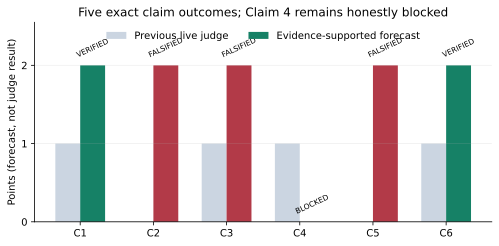

# Exact-claim reproduction: Gradient Flow Sampler-based DRO



[](https://molab.marimo.io/github/MachineLearning-Nerd/icml26-repro-QRtzkKrbJi-gradient-flow-sampler-based-distributionally-robust-optimization/blob/main/notebooks/gfs_dro_reproduction.py)

This campaign audits all six judged claims from
[Gradient Flow Sampler-based Distributionally Robust Optimization](https://arxiv.org/abs/2510.25956)
against the exact arXiv v1 contract. The previous Hugging Face logbook scored
**4/12**. The new evidence supports Claims 1 and 6 as VERIFIED, Claims 2 and 3
as FALSIFIED by assumption-satisfying analytical counterexamples, and the
strict live-judge wording of Claim 5 as FALSIFIED by the authors' complete
CIFAR-10 Figure 6 vector data. Claim 4 remains BLOCKED after four distinct
routes.

The strongest empirical counterexample is at `epsilon=0.2, Delta=0.008`:
the paper figure gives WRM **80.5616%** robust accuracy, versus WFR **78.3016%**
and WGF **77.8714%**. This is exact vector extraction, not raster digitization
or reduced training. The six-algorithm conformance test uses a smooth
eight-dimensional fixture and is explicitly not presented as CIFAR-10
evidence. All managed runs used Hugging Face `cpu-upgrade`, with no GPU.

The conservative projected score is **8–10/12** and the best-supported
possible score is **10/12**. These are forecasts; the live judged score remains
4/12 until the evaluator records a new revision.

- [Illustrated technical report](reports/reproduction/report.md)
- [Self-contained marimo tutorial](notebooks/gfs_dro_reproduction.py)
- [Release forecast and evidence ledger](reports/reproduction/release_report.md)

## Experiment log

Every experiment inherited this exact command:
`uv run --frozen --no-dev python -m reproduction.run_all`.

| Branch / experiment | Purpose or change | Exact run command | Assessment / outcome | Compute |
|---|---|---|---|---|
| [`orx/judged-4-of-12-baseline`](https://github.com/MachineLearning-Nerd/icml26-repro-QRtzkKrbJi-gradient-flow-sampler-based-distributionally-robust-optimization/tree/orx/judged-4-of-12-baseline) | Freeze exact judged 4/12 artifact and source contract | `uv run --frozen --no-dev python -m reproduction.run_all` | Historical baseline reproduced and protected | HF `cpu-upgrade`, CPU only |
| [`orx/claim-6-continuous-half-bridge-certificate`](https://github.com/MachineLearning-Nerd/icml26-repro-QRtzkKrbJi-gradient-flow-sampler-based-distributionally-robust-optimization/tree/orx/claim-6-continuous-half-bridge-certificate) | Functional half-bridge proof certificate | `uv run --frozen --no-dev python -m reproduction.run_all` | Claim 6 VERIFIED · HIGH | HF `cpu-upgrade`, one-process verifier |
| [`orx/claim-2-necessary-time-counterexample`](https://github.com/MachineLearning-Nerd/icml26-repro-QRtzkKrbJi-gradient-flow-sampler-based-distributionally-robust-optimization/tree/orx/claim-2-necessary-time-counterexample) | Necessary-time counterexample | `uv run --frozen --no-dev python -m reproduction.run_all` | Claim 2 FALSIFIED · HIGH | HF `cpu-upgrade`, one-process verifier |
| [`orx/claim-3-exact-stochastic-rate-counterexample`](https://github.com/MachineLearning-Nerd/icml26-repro-QRtzkKrbJi-gradient-flow-sampler-based-distributionally-robust-optimization/tree/orx/claim-3-exact-stochastic-rate-counterexample) | Exact last-iterate rate lower bound | `uv run --frozen --no-dev python -m reproduction.run_all` | Claim 3 FALSIFIED · HIGH | HF `cpu-upgrade`, one-process verifier |
| [`orx/claim-4-four-route-complexity-audit`](https://github.com/MachineLearning-Nerd/icml26-repro-QRtzkKrbJi-gradient-flow-sampler-based-distributionally-robust-optimization/tree/orx/claim-4-four-route-complexity-audit) | Proof, version, source, and falsification routes | `uv run --frozen --no-dev python -m reproduction.run_all` | Claim 4 BLOCKED · LOW | HF `cpu-upgrade`, one-process verifier |
| [`orx/claim-1-six-algorithm-conformance`](https://github.com/MachineLearning-Nerd/icml26-repro-QRtzkKrbJi-gradient-flow-sampler-based-distributionally-robust-optimization/tree/orx/claim-1-six-algorithm-conformance) | Algorithms 1–6 conformance and six defect controls | `uv run --frozen --no-dev python -m reproduction.run_all` | Claim 1 VERIFIED · HIGH | HF `cpu-upgrade`, one-process verifier |
| [`orx/claim-5-exact-figure-6-vector-falsification`](https://github.com/MachineLearning-Nerd/icml26-repro-QRtzkKrbJi-gradient-flow-sampler-based-distributionally-robust-optimization/tree/orx/claim-5-exact-figure-6-vector-falsification) | Exhaustive official CIFAR-10 vector audit | `uv run --frozen --no-dev python -m reproduction.run_all` | Claim 5 FALSIFIED · MEDIUM | HF `cpu-upgrade`; 8.479088 s cumulative science |
| [`orx/evaluator-visible-cumulative-release-candidate`](https://github.com/MachineLearning-Nerd/icml26-repro-QRtzkKrbJi-gradient-flow-sampler-based-distributionally-robust-optimization/tree/orx/evaluator-visible-cumulative-release-candidate) | Visibility, subset, security, and cumulative release gates | `uv run --frozen --no-dev python -m reproduction.run_all` | Release-candidate regression (see report for final run) | HF `cpu-upgrade`, CPU only |
| `main` | Public README, report, notebook, and published text mirror | Not run as an experiment (publication surface) | Presentation-only | No experiment compute |

## Reproduce

```bash
uv sync --frozen
uv run --frozen --no-dev python -m reproduction.run_all
```

The environment is Python 3.12 with one repository-level `.venv` and the
committed `uv.lock`. The current verifier fails closed on any claim result,
independent checker, negative control, historical hash, or evaluator-visible
release gate.

## Historical judged baseline

The exact Hugging Face revision
`735012f52396955c5734e8fc568adfdf2abda757` is immutable under
`historical/judged_space_735012f52396955c5734e8fc568adfdf2abda757/`.
Its previous toy pages are retained as **Historical rejected baseline** and do
not appear as the current verification.
