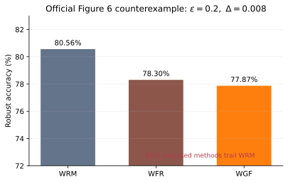

# Claim 5 — FALSIFIED

## Exact evaluated claim

The live judged claim says both WGF and WFR achieve higher robust accuracy at
every plotted CIFAR-10 perturbation setting than the baseline DRO methods Dual
and WRM. Formally, for every entropy value, nonzero attack radius, proposed
method, and baseline, the proposed test error must be strictly lower.

The v1 paper's literal prose is weaker: it says the methods achieve a
qualitative “high degree of robustness.” This interpretation difference is the
reason for MEDIUM rather than HIGH confidence.

## Exact full-scale counterexample

The checker parses all 132 exact `M/L` vector coordinates from the authors'
three committed Figure 6 PDFs at official code SHA
`6f9fb5c9e432b5cc6ad62916b36f102984b4d076`. It calibrates the axes from
independent tick coordinates and tests all 120 nonzero comparisons.

At `epsilon=0.2, Delta=0.008`:

| Method | Test error | Robust accuracy |
|---|---:|---:|
| WRM baseline | 19.4384% | 80.5616% |
| WFR | 21.6984% | 78.3016% |
| WGF | 22.1286% | 77.8714% |

WRM therefore exceeds WFR by 2.2600 and WGF by 2.6902 percentage points.
Across all nonzero settings, WFR has 29 strict-dominance violations and WGF
has 20. The dominance-satisfying synthetic control has zero violations and
exits 1 as expected.

Code: [vector extractor](../../../evidence/claim_5/vector_extractor.py),
[exhaustive checker](../../../evidence/claim_5/independent_checker.py),
[verifier](../../../evidence/claim_5/verifier.py), and
[control](../../../evidence/claim_5/negative_control.py).

Raw: [source paths and PDF hashes](../../../evidence/claim_5/official_vector_paths.json),
[counterexample JSON](../../../evidence/claim_5/raw_counterexamples.json),
[checker output](../../../evidence/claim_5/independent_checker_output.json),
and [control output](../../../evidence/claim_5/negative_control_output.json).
Contract and source:
[claim contract](../../../evidence/claim_5/claim_contract.json) and
[source audit](../../../evidence/claim_5/source_audit.md).

## Reproducibility

Run `uv run --frozen --no-dev python -m reproduction.run_all` with Python
3.12 and the linked repository-level [`uv.lock`](../../../uv.lock). Evidence
SHA: `313c0a3d56185c5f1a74d2d6945e0dafd6445bf7`; official-code SHA:
`6f9fb5c9e432b5cc6ad62916b36f102984b4d076`. Exact vector parsing is
deterministic (seed: not applicable). The HF `cpu-upgrade` job reported 64
logical CPUs; the verifier is single-process. Claim-verifier runtime was
0.129534 s (8.479088 s cumulative).

## Verdict and limitations

**FALSIFIED · MEDIUM confidence** for the strict live judged wording. This is
an exact analysis of the authors' full CIFAR-10 evidence, not independent
retraining. The official repository omits the required feature tensor, uses a
single repeat, and contains caption/code inconsistencies; those limitations
are [audited](../../../evidence/claim_5/official_code_audit.json) but are not
used as counterexamples.
