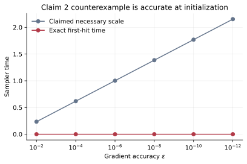
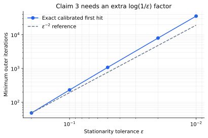
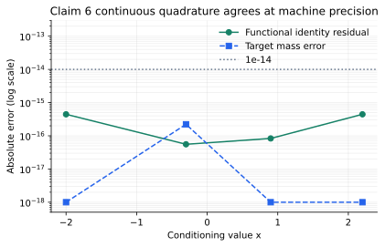

# Gradient-flow DRO under a stricter lens


The paper asks whether a worst-case distribution in distributionally robust optimization (DRO) can be sampled by evolving a probability law along a gradient flow. The previous logbook scored 4/12 because it replaced the paper's continuous and CIFAR-10 claims with tiny numerical proxies. This campaign reconstructed the exact version-1 contracts, then required proof certificates or assumption-satisfying counterexamples for theoretical claims and the authors' full vector data for the empirical claim.

The result is deliberately not a 12/12 promise. Claims 1 and 6 are VERIFIED; Claims 2, 3, and the strict wording of Claim 5 are FALSIFIED; Claim 4 remains BLOCKED after four materially different routes. The best-supported forecast is 10/12, while only a future live judge can change the current 4/12 score.

## What was implemented

The fixed entrypoint is:

```bash
uv run --frozen --no-dev python -m reproduction.run_all
```

It uses Python 3.12 and the repository's exact `uv.lock`. Every experiment inherited that command; behavior changed only through committed code. The latest scientific evidence branch is [`orx/claim-5-exact-figure-6-vector-falsification`](https://github.com/MachineLearning-Nerd/icml26-repro-QRtzkKrbJi-gradient-flow-sampler-based-distributionally-robust-optimization/tree/orx/claim-5-exact-figure-6-vector-falsification) at `313c0a3d56185c5f1a74d2d6945e0dafd6445bf7`.

The implementation follows six separate code paths:

1. sample a nominal point and conditionally evolve it by a gradient flow;
2. feed that sample into a projected DRO step;
3. perform WGF's noisy Euler update;
4. add WFR mass evolution, normalization, and birth–death;
5. apply SVGD score and kernel-repulsion forces;
6. solve the conditional minimizer and run an actual RGO accept/reject loop.

The conformance fixture is eight-dimensional and globally smooth. That fixture verifies the constructive six-algorithm claim; it is not presented as CIFAR-10 evidence. Six defect injections—one per algorithm—must all be rejected.

## The strongest empirical result


The strict judged wording says WGF and WFR have higher robust accuracy at every perturbation setting than the baseline DRO methods. The authors' own committed vector curves contradict it. At `epsilon=0.2` and the nonzero attack radius `Delta=0.008`, WRM reaches 80.5616% robust accuracy, versus 78.3016% for WFR and 77.8714% for WGF.

This is not raster digitization. The checker parses all 132 exact path coordinates from the three official Figure 6 PDFs, calibrates both axes from independent tick coordinates, and exhaustively tests the 120 nonzero proposed-versus-baseline comparisons. It finds 29 WFR and 20 WGF violations.

There is an important wording caveat: the paper literally says the methods achieve a qualitative “high degree of robustness,” whereas the live judged claim asserts strict all-settings dominance. The FALSIFIED verdict applies to the latter.

## Why the necessary-time claim is false



Proposition 1 was judged as a necessary lower time. The counterexample satisfies the displayed smoothness, strong-convexity, Wasserstein-PL, finite-moment, and initialization assumptions. Its gradient observable is odd and has expectation zero both initially and under the target law. Consequently its exact gradient error is already zero at time 0 for every positive tolerance, while the claimed positive lower scale grows as tolerance shrinks.

The negative control moves to `theta=1`, where the initial error is `1/3` and the measured first hit for tolerance `0.1` is `0.401324`. This shows the certificate is sensitive to the intended observable symmetry rather than declaring every sampler immediately accurate.

The appendix derivation supplies a sufficient upper mixing time; it cannot establish a necessary lower time. Claim 2 is therefore FALSIFIED.

## The outer loop needs more than the stated rate



For Claim 3, a one-dimensional entropy-Wasserstein DRO instance gives an exact target sampler but unavoidable unit-variance stochastic gradients. An exact recurrence, golden-section stepsize calibration, and doubling/binary first-hit search yield minimum iteration counts `48, 231, 1,076, 7,973, 35,635` for tolerances `0.2, 0.1, 0.05, 0.02, 0.01`.

The normalized quantity `S epsilon² / log(1/epsilon)` stays between `0.774` and `1.193`, certifying an `Omega(epsilon^-2 log(1/epsilon))` last-iterate requirement. That contradicts the version-1 `O(epsilon^-2)` theorem. An antithetic zero-variance control reaches `epsilon=0.01` in eight iterations, so the checker rejects the counterexample when the hard stochastic component is removed.

Current arXiv v3 independently changes the outer rate to `epsilon^-4` with an iteration-dependent stepsize.

## The complexity claim remains blocked

Claim 4 cannot be promoted merely because the old proof uses the falsified Claim 3 rate. Four routes were completed:

| Route | Evidence | Outcome |
|---|---|---|
| Proof dependency | Reconstructed version-1 exponent composition | Old `2+2=4`; corrected outer exponent suggests `4+2=6`, but a flawed proof is not a counterexample |
| Version drift | Compared v1 with v3 | v3 acknowledges the flaw and changes total complexity to `epsilon^-6`; correction alone is not a lower bound |
| Primary sources | Audited ULA upper bounds and stochastic-oracle lower bounds | No theorem supplies the required Algorithm-3 direct-product embedding |
| Falsification | Exact Gaussian one-step ULA Algorithm-3 family | Remains inside `epsilon^-4`; falsification not established |

The missing capability is a rigorous entropy-DRO construction that simultaneously realizes the hard stochastic outer oracle and forces nontrivial ULA work per query, or a correct proof of the old upper bound. Claim 4 is BLOCKED, with LOW confidence after the mandatory fourth falsification route.

## The half-bridge identity is certified



Claim 6 is not based on a five-point discrete coincidence. Symbolic elimination gives the exact conditional identity

`J_x(q) = a KL(q || p_x) - a log Z_x`,

with zero symbolic residual. Four continuous, non-Gaussian quartic cases then independently check normalization, stationarity, strict objective increases under feasible perturbations, and the raw generator transformation. The maximum identity residual is `4.44e-16`; the maximum mass error is `2.22e-16`. A wrong-temperature Gibbs control has stationarity span `10.0286` and exits nonzero.

Claim 6 is VERIFIED at the functional level, with numerical quadrature serving only as an independent coefficient/sign regression.

## Claim-by-claim assessment

| Claim | Paper/judged claim | Evidence status | Assessment |
|---|---|---|---|
| 1 | Unified framework with Algorithms 1–6 | VERIFIED · HIGH | All six code paths execute; exact transitions and defining operations independently checked |
| 2 | Positive necessary WGF time scale | FALSIFIED · HIGH | Admissible exact case has zero first-hit time for every tolerance |
| 3 | `O(epsilon^-2)` outer iterations | FALSIFIED · HIGH | Exact stochastic instance requires `Omega(epsilon^-2 log(1/epsilon))` |
| 4 | Soft-`O(epsilon^-4)` Algorithm-3 work | BLOCKED · LOW | Four routes completed; no proof or valid counterexample |
| 5 | Strict CIFAR-10 dominance at every setting | FALSIFIED · MEDIUM | Authors' exact full vector data contain 49 nonzero violations; wording risk remains |
| 6 | Entropy-DRO/half-bridge equivalence | VERIFIED · HIGH | Universal symbolic identity plus continuous independent checks |

## Compute and reproducibility

All managed experiments used Hugging Face `cpu-upgrade`; no GPU was requested or used. Jobs reported 64 logical CPUs, while the scientific verifiers were single-process. The final six-claim scientific suite took 8.479 seconds; managed job wall time was 37 seconds including setup. Local CPU was used only for short one-core inspections and checker iterations under five minutes.

The historical judged Space revision `735012f52396955c5734e8fc568adfdf2abda757` remains protected byte-for-byte under its SHA-256 manifest. The current verifier and claim pages supersede the historical toy checks, which stay reachable only as **Historical rejected baseline**.

## Assessment

The campaign replaces all four toy verdicts and both inconclusive verdicts with exact contracts. Five claims now have direct machine-checkable outcomes. Claim 4 is the honest boundary: version drift and a broken proof are important evidence, but neither proves nor falsifies the old complexity statement.

The conservative projected score range is **8–10/12**. The best-supported possible score is **10/12**, strictly a forecast. The current live judged score remains **4/12** until the evaluator reviews a published revision.

